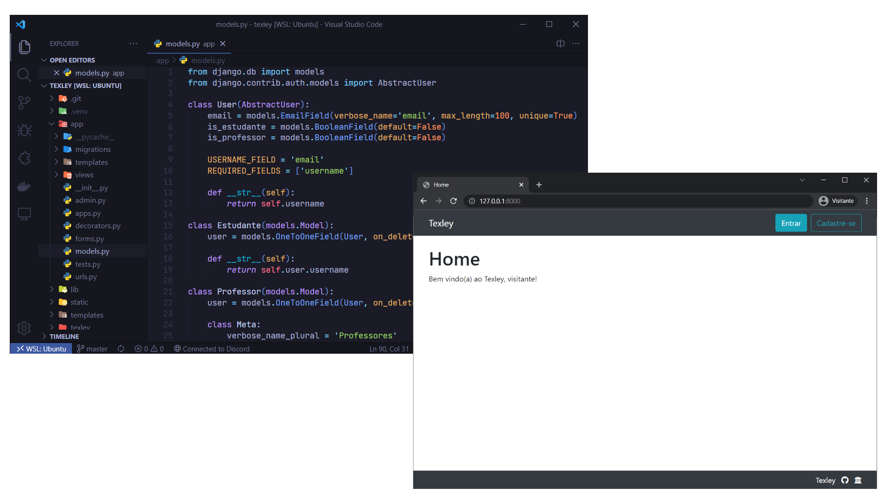

<h1 align="center">Texley</h1>

  
  

  

## :hammer_and_wrench: Tecnologias
Este projeto foi desenvolvido com as tecnologias a seguir:
- [Django](https://docs.djangoproject.com/en/2.2/)
- [Bootstrap](https://getbootstrap.com/docs/4.3/getting-started/introduction/)
- [Docker Compose](https://docs.docker.com/compose/)
- [MySQL](https://dev.mysql.com/doc/refman/8.0/en/)

## :computer: Sobre o projeto
Texley é uma ferramenta para apoiar o feedback em disciplinas de programação introdutória, através da extração de medidas de métricas de software.

## :rocket: Como executar
1. Criação e execução do banco de dados: `docker-compose up -d`. 
2. Criação do ambiente virtual: `python3 -m venv .venv`.
3. Ativação do ambiente virtual: `.venv\Scripts\activate` ou `source .venv/bin/activate`.
4. Instalação das dependências: `pip install -r requirements.txt`.
5. Migração dos modelos: `python3 manage.py migrate`.
6. Execução: `python3 manage.py runserver`.
